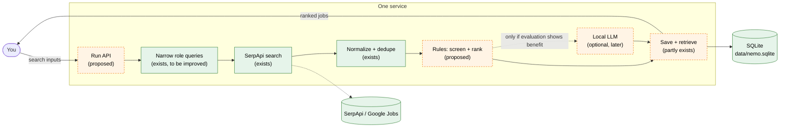

# Phase 1 architecture (short version, for review)

Status: **proposal; "Proposed" parts are not built.** Updated 2026-10-02. Older docs [02](02-scope.md) and [03](03-architecture.md) describe an earlier, stricter design (verified posting dates, Tavily first); this page replaces them where they differ. Background: [07 provider findings](07-search-provider-findings.md), [06 local model](06-local-model-findings.md).

## 1. Scope

Phase 1 is **one service and one SQLite database.** You give it search inputs. It finds jobs, screens and ranks them, and saves each job's description and application links. You read a ranked list.

A useful result: most top jobs fit your target roles, every job keeps its description and links, and anything excluded or not searched is visible.

Out of scope: résumé tailoring (Phase 2), applying, new scraping providers, provider fallback. **Bright Data code stays dormant.** Phase 2 will read only what Phase 1 saves: description, links, provenance and the match assessment.

## 2. What exists today

`scripts/run_search.py` is a hand-run, synchronous script.

1. It builds up to 32 searches from your roles and locations (`src/nemo/discovery.py`).
2. It sends them to **SerpApi** (Google Jobs and Google Search). Tavily is used only in probe scripts.
3. It keeps jobs that carry a LinkedIn job link, removes duplicates by LinkedIn job ID, and saves them (`src/nemo/store.py`, `data/nemo.sqlite`, `runs/<id>/`).

**Where data comes from:** title, company, location and description come from *Google's listing*, not from LinkedIn. No code fetches a LinkedIn page. Posting ages are Google's claims. Of the 15 jobs in `runs/20261001T051357Z-847ccd`, 7 came from other sites with a LinkedIn link attached.

**Gaps:** no screening or ranking (broad terms like "Quality Assurance" and "automation" returned lab, supplier-quality and technical-writing jobs); only the LinkedIn apply link is kept; a crashed run loses work; the last run completed 4 of 32 planned searches.

## 3. Proposed flow

Green exists; orange dashed is proposed.

**Queries:** narrow software-role searches (for example "software QA engineer", "SDET", "backend engineer") rather than bare "QA" or "automation", based on your target roles.

**Relevance:** rules first. A job is excluded only for a clear violation of a genuine dealbreaker. Preferences change ranking only. If a posting doesn't state a requirement, it stays **unknown**, and unknowns are not penalised automatically. Each job shows **fit** (how well it matches) and **confidence** (how much the description actually says) separately. The local LLM is added only if evaluation (§6) shows rules miss something it catches.

**Visibility (a design goal, not a guarantee):** excluded jobs are saved with their reason; each run reports searches completed versus planned; failed or empty searches are listed. Search coverage is still partial: Google/SerpApi may never surface a relevant job.

## 4. Inputs and outputs (proposed)

- **Input:** roles, locations, look-back, and a **maximum number of searches** (a request-count cap, configurable). The existing dollar guard (`src/nemo/budget.py`) stays as a safety net, but its per-search price is an assumption, not verified billing.
- **Run API, two calls:** start a run (returns a run ID, works in the background), and fetch a run (status, searches completed/planned, ranked jobs). HTTP framework choice is deferred.
- **Each job:** title, company, location, fit, confidence, reasons, flags, description, **description source**, LinkedIn link if any, **all original application links**, retrieval time. Jobs without a LinkedIn link are kept.

## 5. Minimum database

| Table | Holds | Status |
|---|---|---|
| `runs`, `run_queries` | run status, each search and outcome | exists; add `running` state and crash recovery |
| `jobs` | one row per job: LinkedIn job ID when present, otherwise provider job ID plus apply link; description, source, first/last seen | exists; extend identity and provenance |
| `job_links` | every application link, labelled | proposed |
| `run_jobs` | jobs found per run, raw listing | exists |
| `assessments` | per run and job: fit, confidence, reasons, exclusions, rule version | proposed |

A repeat sighting updates the one `jobs` row and adds a `run_jobs` row, so history is kept and nothing is duplicated. Jobs are never merged by title alone.

## 6. Security and evaluation

- Keys only in `.env`/environment, never in git, logs or the database; `.env` and the database readable only by you. Listen on localhost only. Bound query parameters (already used). Logs hold IDs and counts, not descriptions. Descriptions are untrusted text; if an LLM is ever used, it gets them as data with no tools and its output is format-checked. Back up by copying the database file.
- **Evaluation:** [`runs/review-batch.md`](../../runs/review-batch.md) (local, gitignored) holds 10 deduplicated saved jobs. You label each relevant / maybe / not relevant. We then check whether the rules keep your "relevant" jobs, rank them high, and exclude none by mistake.

## 7. Next steps

1. Label the 10 jobs; write the rules against them.
2. Capture all links and provenance; add `assessments`, run state, recovery.
3. Expose the two-call service.
4. One real end-to-end run, reviewed together.

## 8. Needed from you

1. **Target roles and relevant experience** (to narrow queries and define fit).
2. **Acceptable locations and work arrangements, and genuine dealbreakers.**
